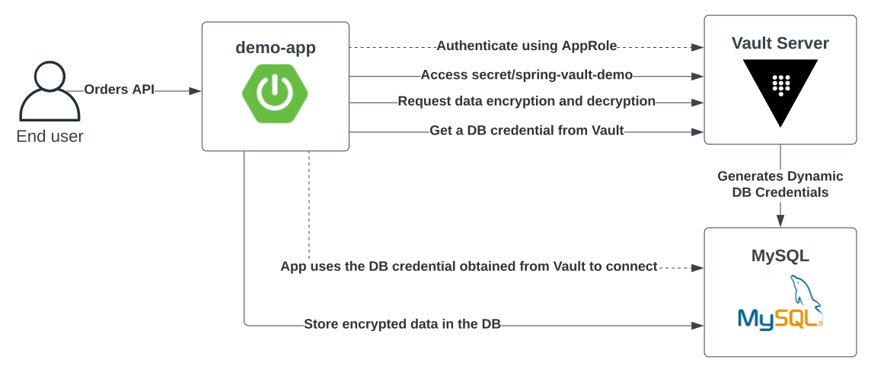

# Vault Java App Demo

This repo demonstrates the integration between Vault and a sample Java application using the 
[Spring Cloud Vault](https://cloud.spring.io/spring-cloud-vault/reference/html/) library. 



- demo-app is a Spring Boot application that exposes a REST API.
    - The app authenticates to Vault using [AppRole](https://developer.hashicorp.com/vault/docs/auth/approle) auth method
    - The app calls Vault to retrieve static KV secrets, encrypt and decrypt data using the transit secrets engine, 
      and get dynamic database credentials to connect to MySQL database.
    - The app uses the Spring Cloud Vault library to integrate with the Vault API.
- On the Vault server side 3 secrets engines are enabled: database, KV, and transit
    - The database secrets engine integrates with MySQL to generate dynamic DB credentials for the demo-app
    - The transit secrets engine is used for encrypting and decrypting application data
- [Sample Postman collection](spring-vault-demo/demo.postman_collection.json) included
  
# Run

```shell
# export Vault license
export VAULT_LICENSE=$(cat ~/Downloads/vault.hclic)     

# Start all containers
make all

# Login to Vault as admin
export VAULT_ADDR=http://localhost:8200
vault login --method=userpass username=admin password=passw0rd
```

# Useful commands
```shell

# login to mysql and show table schema
docker exec -it mysql sh
mysql -uroot -ppassw0rd
use demo;
describe orders;

# build demo-api spring boot app
make build-api

# run demo-api spring boot app locally
make run-api

# build demo-api app docker image
make build-docker-api

```

# Reference
- [Spring Cloud Vault](https://cloud.spring.io/spring-cloud-vault/reference/html/#_quick_start)
- [Vault Java Application Demo Tutorial](https://developer.hashicorp.com/vault/tutorials/encryption-as-a-service/eaas-spring-demo)
- [Read Secrets From Vault Using Vault Agent](https://developer.hashicorp.com/vault/tutorials/vault-agent/agent-read-secrets)
- [Refreshing Spring Configuration at runtime](https://cloud.spring.io/spring-cloud-static/Greenwich.RELEASE/multi/multi__spring_cloud_config_2.html#_refreshing_the_configuration_at_runtime)
- [Rotating Vault Database Secrets in Spring Boot](https://secrets-as-a-service.com/posts/hashicorp-vault/rotate-dynamic-relational-database-connection-in-spring-at-runtime/)